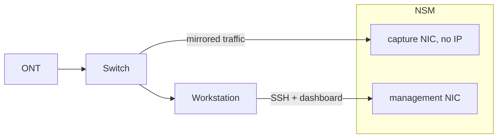

# ShadowMeld — NSM Sensor

ShadowMeld is my project to build and run a headless network security monitoring sensor on a Protectli VP2430.
It captures network traffic and runs its monitoring stack in Podman containers, managed out-of-band
over a serial console and SSH. Capture is handled by tcpdump for raw packets, Zeek for traffic
analysis, and Suricata for intrusion detection. I've set the switch to port mirroring, so the sensor
gets a copy of all traffic without sitting in the path — if the sensor is off, the rest of the network
stays online. I also monitor the sensor's own hardware with node_exporter feeding Prometheus and Grafana.

## Architecture

## Hardware

- Protectli VP2430 — Intel N150
- 32 GB DDR5 @ 4800 MHz
- NVMe SSD
- 4× Intel i226-V 2.5GbE NICs
- Firmware: Dasharo (coreboot + UEFI)
- TP-Link TL-SG105E — managed switch, port mirroring
- Intel X550-T2 — workstation NIC, dedicated management link

## Stack

- [x] Debian (minimal, headless base OS)
- [x] serial getty (out-of-band rescue console)
- [ ] OpenSSH (remote management)
- [x] nftables + sysctl + grub (system hardening)
- [x] Podman + Quadlet (container runtime)
- [x] tcpdump (packet capture)
- [x] Zeek (network analysis)
- [ ] Suricata (IDS)
- [ ] node_exporter (host metrics)
- [ ] Prometheus + Grafana (host monitoring)

## Installation

Installed and managed headless over COM cable.
Serial settings: **115200 8N1**.
Each step is documented separately under [`docs/`](docs/):

- [Debian installation](docs/debian-installation.md)
- [System hardening](docs/system-hardening.md)
- [Podman setup](docs/podman.md)
- [tcpdump setup](docs/tcpdump.md)
- [Zeek setup](docs/zeek.md)

