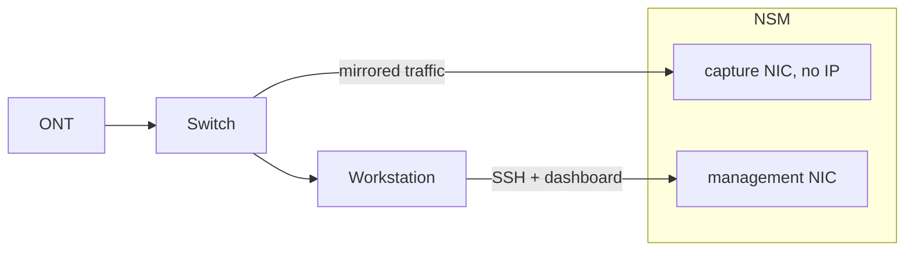

# ShadowMeld — NSM Sensor

ShadowMeld is a network security monitoring (NSM) sensor that runs on a Protectli VP2430. Capturing network traffic and running the monitoring stack 
in Podman containers orchestrated by Quadlet, it is managed over serial console and SSH. Packet capture uses tcpdump, traffic analysis uses Zeek,
and intrusion detection uses Suricata (IDS). The sensor's hardware is monitored with node_exporter and Prometheus. Sensor's logs are
forwarded to linux workstation with Filebeat and processed with an ELK stack. Hardware metrics from Prometheus are visualized in Grafana on the workstation.

## Architecture

## Hardware

- Protectli VP2430 — Intel N150
- 32 GB DDR5 @ 4800 MHz
- NVMe SSD
- 4× Intel i226-V 2.5GbE NICs
- Firmware: Dasharo (coreboot + UEFI)
- TP-Link TL-SG105E — managed switch, port mirroring
- Intel X550-T2 — workstation NIC, dedicated management link

## Sensor Stack

- [x] Debian
- [x] serial getty
- [x] OpenSSH
- [x] System hardening (nftables + sysctl + grub)
- [x] Podman + Quadlet
- [x] tcpdump
- [x] Zeek
- [x] Suricata
- [x] node_exporter
- [x] Prometheus
- [ ] Filebeat

## Workstation

- [ ] ELK stack (Elasticsearch + Logstash + Kibana)
- [ ] Grafana

## Installation

Installed and managed headless over COM cable.
Serial settings: **115200 8N1**.

Each step is documented separately under [`docs/`](docs/):

- [Debian installation](docs/debian-installation.md)
- [System hardening](docs/system-hardening.md)
- [Network setup](docs/network-setup.md)
- [Podman](docs/podman.md)
- [tcpdump](docs/tcpdump.md)
- [Zeek](docs/zeek.md)
- [Suricata](docs/suricata.md)
- [Prometheus](docs/prometheus.md)
